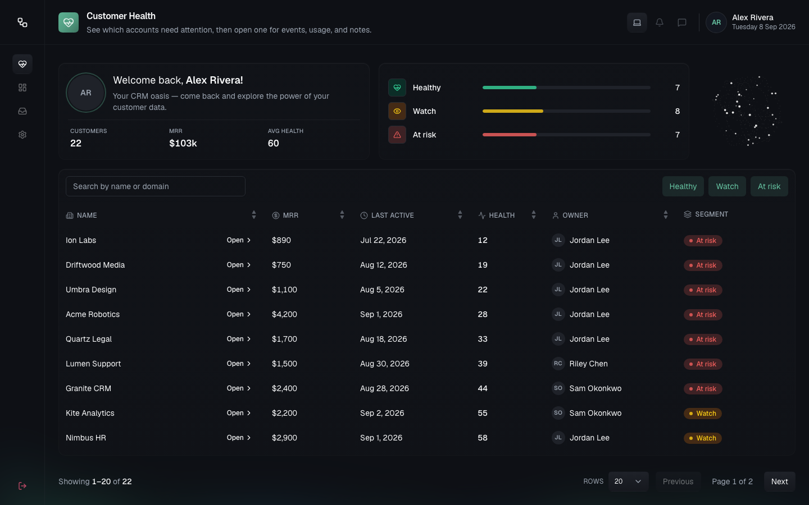

# FlowDesk — Customer Health

FlowDesk is a SaaS product that gives customer success teams a **360° view of their customers**.

This repository implements the **Customer Health Overview** page: a place for CSMs to see which accounts are healthy and which are at risk, so they can prioritize their time.

**Stack:** React, Next.js (App Router), TypeScript, Tailwind CSS, and a shared UI component set.

**APIs:**

```
GET /api/customers?search=&segment=&page=&page_size=
GET /api/customers/{id}/health
```

### What CSMs can do

1. Browse a **sortable table** of customers (name, MRR, last active, health score, owner).
2. Open a **right-side drawer** for recent events, usage trends, and notes.
3. **Filter** by health segment (Healthy / Watch / At Risk) and **search** by name or domain.



The table uses **server-side pagination**. Loading and error states stay consistent with the design system. The route prefers **Server Components**, with client islands only where interaction requires them.

---

## Architectural overview

- **Server-first App Router.** Thin `app/` routes load data and compose views; `"use client"` only for interactive islands (list URL, toolbar, details panel, app chrome).
- **URL is list source of truth.** Search, multi-select segment, multi-level sort, pagination, and `customerId` live in `searchParams` (shareable, back/forward friendly). Soft navigations use `{ scroll: false }` and delayed `useTransition` dimming.
- **Details panel is state-first.** Local state opens the in-layout panel immediately; the URL mirrors asynchronously so open/close stays snappy (see [ADR-003](./docs/adr/003-drawer-state-first-url-mirror.md)).
- **Two data paths.** List + overview metrics load on the server (entity queries / fixtures). Drawer health loads on the client with a small in-memory cache and intentional prefetch (no TanStack this phase — [ADR-004](./docs/adr/004-no-tanstack-this-phase.md), [ADR-006](./docs/adr/006-list-server-drawer-client-cache.md)).
- **Layered domain folders.** Dependency direction is one-way: `views → features → entities → shared`. `widgets/` holds cross-cutting app chrome.

Deep dives: [docs/architecture/](./docs/architecture/), [docs/adr/](./docs/adr/).

## Structure overview

### Page composition

```
app/layout.tsx
  └─ AppShell (widgets/app-sidebar)     ← sidebar rail/dock + AppHeader
       └─ app/customers/health/page.tsx  ← RSC: searchParams → loaders
            ├─ loadOverviewCards()       ← portfolio aggregates (ADR-007)
            ├─ loadCustomerList(params)  ← filtered/paginated rows
            └─ CustomerHealthPage (views/customer-health)
                 ├─ OverviewCardsRow     ← welcome + segment counts + placeholder
                 └─ CustomerListShell    ← client island
                      ├─ toolbar / DataTable / pagination
                      └─ CustomerDetailsPanel (features/customer-drawer)
```

### App folder responsibilities

| Path | Responsibility |
|---|---|
| `app/` | Routing entrypoints only — `page` / `loading` / `error` / API routes; no business logic |
| `views/customer-health/` | Page composition, list URL contract, overview cards, server use-cases for this route |
| `features/customer-drawer/` | Details open/close, URL mirror, health body + prefetch |
| `entities/customer/` | Domain types, Zod schemas, repository, list/health queries, field catalog |
| `widgets/app-sidebar/` | App shell: header, icon rail (desktop), dock (mobile) |
| `shared/` | Dumb UI (`DataTable`, pagination, search, filters, details panel) and pure helpers |
| `docs/` | Architecture, ADRs, concepts, guides |

Full tree: [docs/initial-file-structure.md](./docs/initial-file-structure.md).

---

## Documentation

| | |
|---|---|
| **File structure** | [docs/initial-file-structure.md](./docs/initial-file-structure.md) |
| **Architectural decisions** | [docs/adr/](./docs/adr/) |
| **Architecture** | [docs/architecture/](./docs/architecture/) |
| **Project phases** | [docs/project-phases.md](./docs/project-phases.md) |
| **Docs index** | [docs/](./docs/) |

**Concepts**

| | |
|---|---|
| Glossary | [docs/concepts/glossary.md](./docs/concepts/glossary.md) |
| Terminology | [docs/concepts/terminology.md](./docs/concepts/terminology.md) |

**Guides**

| | |
|---|---|
| Contributing | [docs/guides/contributing.md](./docs/guides/contributing.md) |
| Testing | [docs/guides/testing.md](./docs/guides/testing.md) |

---

## Local development

```bash
npm install
npm run dev
```

Open [http://localhost:3000](http://localhost:3000). Customer Health: [http://localhost:3000/customers/health](http://localhost:3000/customers/health).
